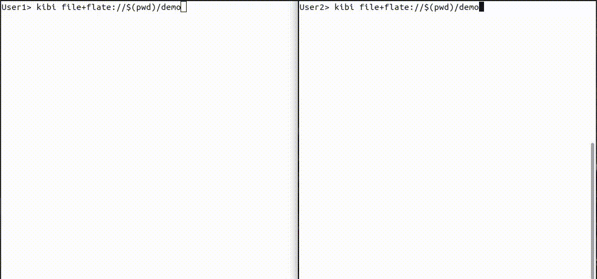

# Kibi: A text editor in ≤1024 lines of code, written in Rust

[](https://github.com/ilai-deutel/kibi/actions/workflows/ci.yml?query=branch%3Amaster)
[](#)
[](https://crates.io/crates/kibi)
[](https://www.rust-lang.org/)
[](#)
[](https://repology.org/project/kibi/versions)
[](https://deps.rs/repo/github/ilai-deutel/kibi)
[](#license)
[](CODE_OF_CONDUCT.md) 
[](https://gitpod.io/#https://github.com/ilai-deutel/kibi
)<!-- ALL-CONTRIBUTORS-BADGE:START - Do not remove or modify this section -->
[](#contributors)
<!-- ALL-CONTRIBUTORS-BADGE:END -->

[](https://asciinema.org/a/KY7tKPlxHXqRdJiv5KaTJbPj5)

A configurable text editor with UTF-8 support, incremental search, syntax
highlighting, line numbers and more, written in less than 1024
lines<sup>[1](#counted-with)</sup> of Rust with minimal dependencies.

Kibi is compatible with Linux, macOS, and Windows
10<sup>[2](#windows-version)</sup>.

This project is inspired by [`kilo`](https://github.com/antirez/kilo), a text
editor written in C.
See [comparison](#comparison-with-kilo) below for a list of additional features.

Contributions are welcome! Be careful to stay below the 1024-line limit...

<!-- markdownlint-disable MD033 -->
<sub><a name="counted-with">1.</a>: Counted per platform, excluding tests and
Clippy directives, see [`count_loc.sh`](count_loc.sh)</sub> \
<sub><a name="windows-version">2.</a>: Kibi requires the terminal to support
ANSI escape sequences. Windows 10 version 1703 ([Creators Update](https://devblogs.microsoft.com/commandline/windows-10-creators-update-whats-new-in-bashwsl-windows-console),
April 2017) and above are supported.</sub>
<!-- markdownlint-enable MD033 -->

## Table of contents

* [Installation](#installation)
  * [With cargo](#with-cargo)
  * [Arch User Repository (Arch Linux)](#arch-user-repository-arch-linux)
  * [Android (with Termux)](#android-with-termux)
  * [Fedora/CentOS](#fedoracentos)
  * [NetBSD](#netbsd)
  * [Flatpak](#flatpak)
* [Usage](#usage)
  * [Keyboard shortcuts](#keyboard-shortcuts)
  * [Configuration](#configuration)
    * [Global configuration](#global-configuration)
    * [Syntax highlighting](#syntax-highlighting)
* [Comparison with kilo](#comparison-with-kilo)
* [Dependencies](#dependencies)
* [Why Kibi?](#why-kibi)
* [Contributors](#contributors)
* [License](#license)

## Installation

<!-- markdownlint-disable MD033 -->
<a href="https://repology.org/project/kibi/versions">
    
</a>
<!-- markdownlint-enable MD033 -->

### With `cargo`

You can install Kibi with [`cargo`](https://github.com/rust-lang/cargo/):

```bash
cargo install kibi
```

Syntax highlighting configuration files are available in the
[`syntax.d`](syntax.d) directory of this repository. They need to be placed in
one of the configuration directories mentioned in the
[Configuration/Syntax Highlighting](#syntax-highlighting) section.

For instance:

```bash
cd ~/repos
git clone https://github.com/ilai-deutel/kibi.git
mkdir -p ~/.local/share/kibi/
ln -sr ./kibi/syntax.d ~/.local/share/kibi/syntax.d
```

### Arch User Repository (Arch Linux)

2 packages are available on the AUR:
[`kibi`](https://aur.archlinux.org/packages/kibi) and
[`kibi-git`](https://aur.archlinux.org/packages/kibi-git).

<details><summary>Installation instructions</summary>

1. Installation with an AUR helper, for instance using `yay`:

   ```bash
   yay -Syu kibi  # or yay -Syu kibi-git
   ```

2. Install manually with `makepkg`:

   ```bash
   git clone https://aur.archlinux.org/kibi.git  # or git clone https://aur.archlinux.org/kibi-git.git
   cd kibi
   makepkg -si
   ```

</details>

### Android (with Termux)

Kibi is available as [a Termux package](https://github.com/termux/termux-packages/tree/master/packages/kibi).

<details><summary>Installation instructions</summary>

1. Install Termux:

   [](https://f-droid.org/repository/browse/?fdid=com.termux)
   [](https://play.google.com/store/apps/details?id=com.termux)

2. Install Kibi within Termux: `pkg install kibi`

</details>

### Fedora/CentOS

The package is available in COPR as [`atim/kibi`](https://copr.fedorainfracloud.org/coprs/atim/kibi).

<details><summary>Installation instructions</summary>

```bash
sudo dnf copr enable atim/kibi -y
sudo dnf install kibi
```

</details>

### NetBSD

Kibi is available from [the official repos](https://cdn.netbsd.org/pub/pkgsrc/current/pkgsrc/editors/kibi/README.html).


<details><summary>Installation instructions</summary>

Install using:

```bash
pkgin install kibi
```

or build from source:

```bash
cd /usr/pkgsrc/editors/kibi
make install
```

</details>

### Flatpak

Kibi is available [on Flathub](https://flathub.org/ca/apps/com.github.ilai_deutel.kibi).

<details><summary>Command line instructions</summary>
 The flatpak can be installed using:
 
```bash
flatpak install flathub com.github.ilai_deutel.kibi
```

You can then run Kibi with:
 
 ```bash
 flatpak run com.github.ilai_deutel.kibi
 ```
</details>

## Usage

```bash
kibi              # Start an new text buffer
kibi <file path>  # Open a file
kibi --version    # Print version information and exit
```

### Keyboard shortcuts

| Keyboard shortcut | Description                                                   |
| ----------------- | ------------------------------------------------------------- |
| Ctrl-F            | Incremental search; use arrows to navigate                    |
| Ctrl-S            | Save the buffer to the current file, or specify the file path |
| Ctrl-G            | Go to `<line number>[:<column number>]` position              |
| Ctrl-Q            | Quit                                                          |
| Ctrl-D            | Duplicate the current row                                     |
| Ctrl-E            | Execute an external command and paste its output              |
| Ctrl-R            | Remove an entire line                                         |
| Ctrl-C            | Copies the entire line                                        |
| Ctrl-X            | Cuts the entire line                                          |
| Ctrl-V            | Will paste the copied line                                    |
| Ctrl-LeftArrow    | Moves cursor to previous word                                 |
| Ctrl-RightArrow   | Moves cursor to next word                                     |

### Configuration

#### Global configuration

Kibi can be configured using a configuration file. It must follow this format:

```ini
# The size of a tab. Must be > 0.
tab_stop=4
# The number of confirmations needed before quitting, when changes have been
# made since the file was last changed.
quit_times=2
# The duration for which messages are shown in the status bar, in seconds.
message_duration=3
# Whether to show line numbers.
show_line_numbers=true
```

The location of these files is described below.

##### Linux / macOS

kibi follows the [XDG Base Directory Specification](https://specifications.freedesktop.org/basedir-spec/basedir-spec-latest.html):

* A user-level configuration file can be located at
  `$XDG_CONFIG_HOME/kibi/config.ini` if environment variable `$XDG_CONFIG_HOME`
  is defined, `~/.config/kibi/config.ini` otherwise.
* A system-wide configuration file can be located at
  `$XDG_CONFIG_DIRS/kibi/config.ini` if environment variable
  `$XDG_CONFIG_DIRS` is defined, `/etc/kibi/config.ini` or
  `/etc/xdg/kibi/config.ini` otherwise.

##### Windows

A configuration file can be located at `%APPDATA%\Kibi\config.ini`.

#### Syntax highlighting

Syntax highlighting can be configured using INI files which follow this format:

<!-- markdownlint-disable MD013 -->
```ini
### /usr/share/kibi/syntax.d/rust.ini ###
# Kibi syntax highlighting configuration for Rust

name=Rust
extensions=rs
highlight_numbers=true
singleline_string_quotes="
singleline_comment_start=//
multiline_comment_delims=/*, */
; In Rust, the multi-line string delimiter is the same as the single-line string
; delimiter
multiline_string_delim="
; https://doc.rust-lang.org/book/appendix-01-keywords.html
keywords_1=abstract, as, async, await, become, box, break, const, continue, crate, do, dyn, else, enum, extern, false, final, fn, for, if, impl, in, let, loop, macro, match, mod, move, mut, override, priv, pub, ref, return, self, Self, static, struct, super, trait, true, try, type, typeof, unsafe, unsized, use, virtual, where, while, yield
keywords_2=i8, i16, i32, i64, i128, isize, u8, u16, u32, u36, u128, usize, f32, f64, bool, char, str
```
<!-- markdownlint-enable MD013 -->

The location of these files is described below.

##### Linux / macOS

kibi follows the [XDG Base Directory Specification](https://specifications.freedesktop.org/basedir-spec/basedir-spec-latest.html):

* User-level syntax highlighting configuration files can be located at `$XDG_DATA_HOME/kibi/syntax.d/<file_name>.ini`
  if environment variable `$XDG_DATA_HOME` is defined,
  `~/.local/share/kibi/syntax.d/<file_name>.ini` otherwise.
* System-wide syntax highlighting configuration files can be located at `$XDG_DATA_DIRS/kibi/syntax.d/<file_name>.ini`
  if environment variable `$XDG_DATA_DIRS` is defined,
  `/usr/local/share/kibi/syntax.d/<file_name>.ini` or
  `/usr/share/kibi/syntax.d/<file_name>.ini` otherwise.

##### Windows

Syntax highlighting configuration files can be located at `%APPDATA%\Kibi\syntax.d\<file_name>.ini`.

## Comparison with `kilo`

This project is inspired by [`kilo`](https://github.com/antirez/kilo), a text
editor written by Salvatore Sanfilippo (antirez) in C, and
[this tutorial](https://viewsourcecode.org/snaptoken/kilo/) (also in C).

`kibi` provides additional features:

* Support for UTF-8 characters
* Compatibility with Windows
* Command to jump to a given row/column
* Handle window resize (UNIX only)
* Parsing configuration files: global editor configuration, language-specific
  syntax highlighting configuration (38 languages and counting)
* Display line numbers on the left of the screen; display file size in the status
  bar
* Syntax highlighting: multi-line strings
* *Save as* prompt when no file name has been provided
* Command to duplicate the current row, to quickly move between words
* Ability to execute an external command from the editor and paste its output
* Memory safety, thanks to Rust!
* Many bug fixes

## Dependencies

This project must remain tiny, so using advanced dependencies such as [`ncurses`](https://crates.io/crates/ncurses),
[`toml`](https://crates.io/crates/toml) or
[`ansi-escapes`](https://crates.io/crates/ansi-escapes) would be cheating.

The following dependencies provide wrappers around system calls.

* On UNIX systems (Linux, macOS):
  * `libc`
* On Windows:
  * `winapi`
  * `winapi-util`

In addition, `unicode-width` is used to determine the displayed width of Unicode
characters. Unfortunately, there is no way around it: the
[unicode character width table](https://github.com/unicode-rs/unicode-width/blob/3033826f8bf05e82724140a981d5941e48fce393/src/tables.rs#L52)
is 230 lines long.

## Why Kibi?

1. Porting the `kilo` source code from C to Rust and trying to make it idiomatic
   was interesting
2. Implementing new features while under the 1024-line constraint is a good challenge
3. Most importantly, I wanted to learn Rust and this was a great project to
   start (thanks Reddit for the idea)

## Contributors

This project follows the [all-contributors](https://allcontributors.org/) specification
([emoji key](https://allcontributors.org/docs/en/emoji-key)). Contributions of
any kind welcome!

<!-- ALL-CONTRIBUTORS-LIST:START - Do not remove or modify this section -->
<!-- prettier-ignore-start -->
<!-- markdownlint-disable -->
<table>
  <tbody>
    <tr>
      <td align="center" valign="top" width="14.28%"><a href="https://github.com/ilai-deutel"><br /><sub><b>Ilaï Deutel</b></sub></a><br /><a href="https://github.com/ilai-deutel/kibi/commits?author=ilai-deutel" title="Code">💻</a> <a href="#ideas-ilai-deutel" title="Ideas, Planning, & Feedback">🤔</a> <a href="#infra-ilai-deutel" title="Infrastructure (Hosting, Build-Tools, etc)">🚇</a> <a href="#platform-ilai-deutel" title="Packaging/porting to new platform">📦</a> <a href="#syntax-highlighting-ilai-deutel" title="Contributing to syntax highlighting configuration files">💠</a></td>
      <td align="center" valign="top" width="14.28%"><a href="https://github.com/codingonHP"><br /><sub><b>Vishal Anand</b></sub></a><br /><a href="https://github.com/ilai-deutel/kibi/issues?q=author%3AcodingonHP" title="Bug reports">🐛</a></td>
      <td align="center" valign="top" width="14.28%"><a href="https://github.com/gsbhasin123"><br /><sub><b>Gurjus Bhasin</b></sub></a><br /><a href="#ideas-gsbhasin123" title="Ideas, Planning, & Feedback">🤔</a></td>
      <td align="center" valign="top" width="14.28%"><a href="https://github.com/ldang0"><br /><sub><b>Libin Dang</b></sub></a><br /><a href="https://github.com/ilai-deutel/kibi/commits?author=ldang0" title="Code">💻</a> <a href="https://github.com/ilai-deutel/kibi/issues?q=author%3Aldang0" title="Bug reports">🐛</a></td>
      <td align="center" valign="top" width="14.28%"><a href="https://github.com/andradei"><br /><sub><b>Isaac Andrade</b></sub></a><br /><a href="#ideas-andradei" title="Ideas, Planning, & Feedback">🤔</a></td>
      <td align="center" valign="top" width="14.28%"><a href="https://github.com/frjol"><br /><sub><b>frjol</b></sub></a><br /><a href="https://github.com/ilai-deutel/kibi/issues?q=author%3Afrjol" title="Bug reports">🐛</a></td>
      <td align="center" valign="top" width="14.28%"><a href="https://github.com/tim77"><br /><sub><b>Artem Polishchuk</b></sub></a><br /><a href="#platform-tim77" title="Packaging/porting to new platform">📦</a></td>
    </tr>
    <tr>
      <td align="center" valign="top" width="14.28%"><a href="https://github.com/malbarbo"><br /><sub><b>Marco A L Barbosa</b></sub></a><br /><a href="https://github.com/ilai-deutel/kibi/commits?author=malbarbo" title="Code">💻</a></td>
      <td align="center" valign="top" width="14.28%"><a href="https://github.com/voidpin"><br /><sub><b>pin</b></sub></a><br /><a href="#platform-voidpin" title="Packaging/porting to new platform">📦</a></td>
      <td align="center" valign="top" width="14.28%"><a href="https://github.com/Uniminin"><br /><sub><b>Uniminin</b></sub></a><br /><a href="#syntax-highlighting-Uniminin" title="Contributing to syntax highlighting configuration files">💠</a></td>
      <td align="center" valign="top" width="14.28%"><a href="https://github.com/Woomy4680-exe"><br /><sub><b>Woomy4680-exe</b></sub></a><br /><a href="https://github.com/ilai-deutel/kibi/issues?q=author%3AWoomy4680-exe" title="Bug reports">🐛</a></td>
      <td align="center" valign="top" width="14.28%"><a href="https://github.com/quadroli"><br /><sub><b>quadroli</b></sub></a><br /><a href="#syntax-highlighting-quadroli" title="Contributing to syntax highlighting configuration files">💠</a></td>
      <td align="center" valign="top" width="14.28%"><a href="https://github.com/m0lese"><br /><sub><b>molese</b></sub></a><br /><a href="#syntax-highlighting-m0lese" title="Contributing to syntax highlighting configuration files">💠</a></td>
      <td align="center" valign="top" width="14.28%"><a href="https://github.com/imreyesjorge"><br /><sub><b>Jorge Reyes</b></sub></a><br /><a href="https://github.com/ilai-deutel/kibi/commits?author=imreyesjorge" title="Code">💻</a></td>
    </tr>
    <tr>
      <td align="center" valign="top" width="14.28%"><a href="https://github.com/gVirtu"><br /><sub><b>Giancarlo França</b></sub></a><br /><a href="https://github.com/ilai-deutel/kibi/commits?author=gVirtu" title="Tests">⚠️</a></td>
      <td align="center" valign="top" width="14.28%"><a href="https://github.com/ilmanzo"><br /><sub><b>Andrea Manzini</b></sub></a><br /><a href="https://github.com/ilai-deutel/kibi/commits?author=ilmanzo" title="Code">💻</a> <a href="https://github.com/ilai-deutel/kibi/commits?author=ilmanzo" title="Tests">⚠️</a></td>
      <td align="center" valign="top" width="14.28%"><a href="https://github.com/Arkaeriit"><br /><sub><b>Maxime Bouillot</b></sub></a><br /><a href="#syntax-highlighting-Arkaeriit" title="Contributing to syntax highlighting configuration files">💠</a></td>
      <td align="center" valign="top" width="14.28%"><a href="https://github.com/john-sharratt"><br /><sub><b>Johnathan Sharratt</b></sub></a><br /><a href="https://github.com/ilai-deutel/kibi/commits?author=john-sharratt" title="Code">💻</a></td>
      <td align="center" valign="top" width="14.28%"><a href="https://github.com/No-one-important"><br /><sub><b>No-one-important</b></sub></a><br /><a href="https://github.com/ilai-deutel/kibi/commits?author=No-one-important" title="Code">💻</a></td>
      <td align="center" valign="top" width="14.28%"><a href="https://github.com/RobertGrancsa"><br /><sub><b>Robert Grancsa</b></sub></a><br /><a href="https://github.com/ilai-deutel/kibi/commits?author=RobertGrancsa" title="Code">💻</a></td>
      <td align="center" valign="top" width="14.28%"><a href="https://github.com/sogreatandpowerfull"><br /><sub><b>SoGreatAndPowerful</b></sub></a><br /><a href="#syntax-highlighting-sogreatandpowerfull" title="Contributing to syntax highlighting configuration files">💠</a></td>
    </tr>
    <tr>
      <td align="center" valign="top" width="14.28%"><a href="https://github.com/carol-mb"><br /><sub><b>Mihai-Carol Bazga</b></sub></a><br /><a href="https://github.com/ilai-deutel/kibi/commits?author=carol-mb" title="Code">💻</a></td>
      <td align="center" valign="top" width="14.28%"><a href="https://github.com/NickGeek"><br /><sub><b>Nick Webster</b></sub></a><br /><a href="https://github.com/ilai-deutel/kibi/commits?author=NickGeek" title="Code">💻</a></td>
      <td align="center" valign="top" width="14.28%"><a href="https://github.com/hezhizhen"><br /><sub><b>Zhizhen He</b></sub></a><br /><a href="https://github.com/ilai-deutel/kibi/commits?author=hezhizhen" title="Documentation">📖</a></td>
      <td align="center" valign="top" width="14.28%"><a href="https://github.com/CosminGGeorgescu"><br /><sub><b>CosminGGeorgescu</b></sub></a><br /><a href="https://github.com/ilai-deutel/kibi/commits?author=CosminGGeorgescu" title="Code">💻</a></td>
    </tr>
  </tbody>
</table>

<!-- markdownlint-restore -->
<!-- prettier-ignore-end -->

<!-- ALL-CONTRIBUTORS-LIST:END -->

## License

This project is licensed under either of

* [Apache License, Version 2.0](LICENSE-APACHE)
* [MIT License](LICENSE-MIT)

at your option.

### Contribution

Unless you explicitly state otherwise, any contribution intentionally submitted
for inclusion in Kibi by you shall be dual licensed as above, without any
additional terms or conditions.
